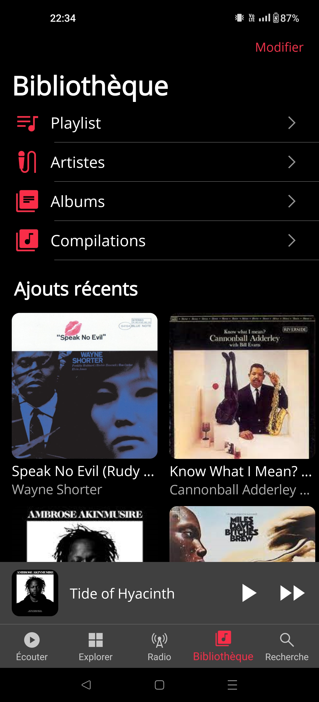

# MauppleMusic

## 📝 Purpose

Copy/paste the *Library* tab of the [AppleMusic](https://www.apple.com/fr/apple-music/) app with [**MAUI**](https://learn.microsoft.com/en-us/dotnet/maui).

    - Available on Android & IOS
    - Only work on view (no model/databiding)
    - Use theme (light/dark)

## 🛠 Languages & tools

           

## 📍 Visuals

> Please note that the screenshots from the original app were taken with an Iphone.
> Thoses of the "Clone-app" were taken with an Android with a different resolution.

 Library section 

| AppleMusic | MauppleMusic |
| --- | --- |
|  |  |
|  |  |
|  |  |
|  |  |

 Albums section 

| AppleMusic | MauppleMusic |
| --- | --- |
|  |  |
|  |  |
|  |  |
|  |  |
|  |  |
|  |  |
|  |  |
|  |  |

          
## ✍️ Credits 

* Author: [**Valetin Clergue**](https://github.com/HandyS11)