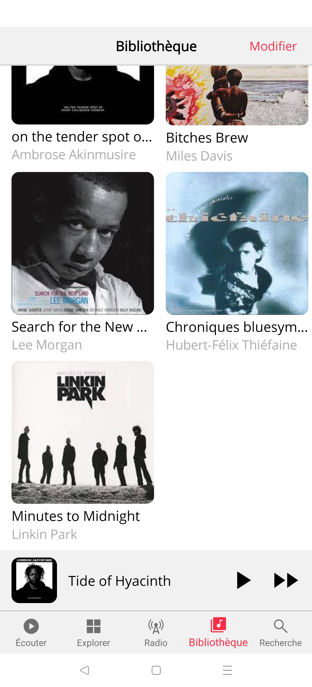
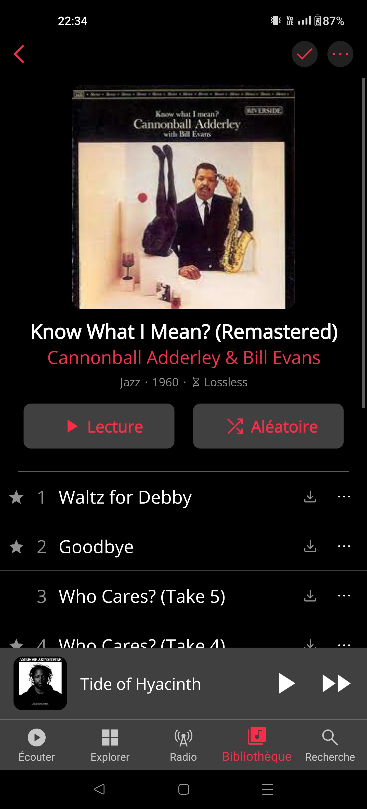

# MauppleMusic

## 📝 Purpose

Copy/paste the *Library* tab of the [AppleMusic](https://www.apple.com/fr/apple-music/) app using [**MAUI**](https://learn.microsoft.com/en-us/dotnet/maui).

- Available on Android & IOS
- Only work on view (no model/databiding)
- Use theme (light/dark)

## 🛠 Languages & tools

           

## 🖊️ Versions 

- [.NET 7](https://learn.microsoft.com/en-us/dotnet/core/whats-new/dotnet-7)
- [Android API](https://developer.android.com/reference) 33 *(tested)*
- [iOS](https://www.apple.com/ios) 16 *(tested)*

## 📍 Visuals

> Please note that the screenshots from the original app were taken with an Iphone.
> Thoses of the "Clone-app" were taken with an Android with a different resolution.

<details><summary> Library section </summary>

| AppleMusic | MauppleMusic |
| --- | --- |
|  |  |
|  |  |
|  |  |
|  |  |
</details>

<details><summary> Albums section </summary>

| AppleMusic | MauppleMusic |
| --- | --- |
|  |  |
|  |  |
|  |  |
|  |  |
|  |  |
|  |  |
|  |  |
|  |  |
</details>

## ⚙️ Known limitations

Due to its youngness *(and ~~maybe~~ certainly because of my lack of knowledge)* the **CollectionView** seems to have some bugs with iOS such as:

- Have it's own **ScrollView** went placed in a component that already own one.
- Wrongly displays the first items when using the **GridItemsLayout**.

> Here is an exemple of code that gave this issue based on the [**MAUI**](https://learn.microsoft.com/en-us/dotnet/maui) project version.

```cs
<CollectionView ItemsSource="{Binding SomeCollection}"
                SelectionMode="None">
    <CollectionView.ItemsLayout>
        <GridItemsLayout Orientation="Vertical" 
                         Span="2" />
    </CollectionView.ItemsLayout>
                    
    <CollectionView.ItemTemplate>
        <DataTemplate>
            <SomeComponent/>
        </DataTemplate>
    </CollectionView.ItemTemplate>
</CollectionView>
```
   
## ✍️ Credits 

* Author: [**Valetin Clergue**](https://github.com/HandyS11)