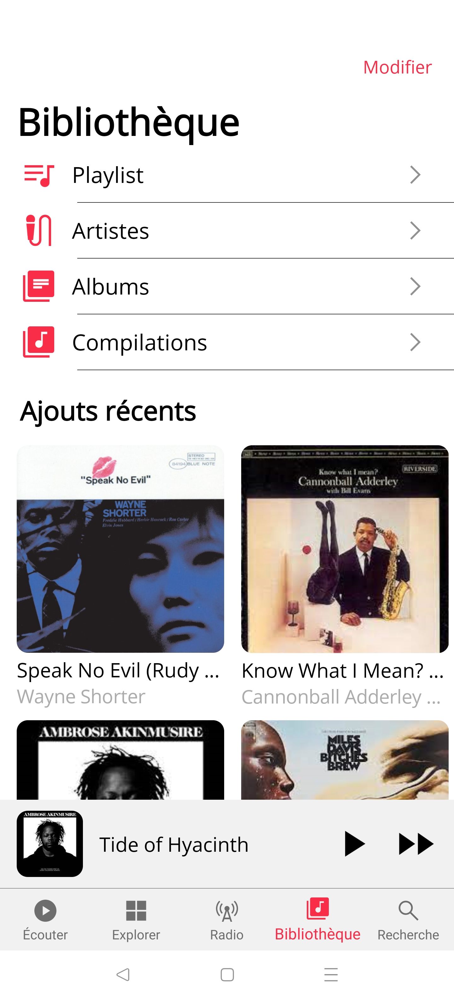
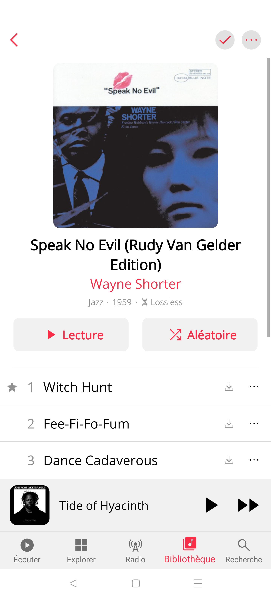
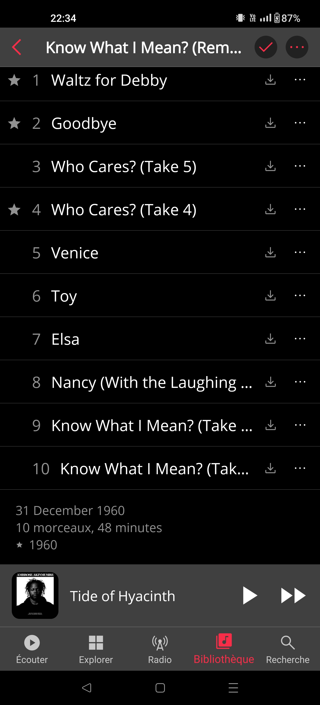

# MauppleMusic

## 📝 Purpose

Copy/paste the **Library** tab of the [AppleMusic](https://www.apple.com/fr/apple-music/) app with [MAUI](https://learn.microsoft.com/en-us/dotnet/maui).

    - Available on Android & IOS
    - Only work on view (no model/databiding)
    - Use theme (light/dark)

## 🛠 Language & tools

## 📍 Visuals

> The original screenshots have been taken using an IPhone.
> It might be some differences with the Clone-App that belongs on an Android.

 Library section 

| AppleMusic | MauppleMusic |
| --- | --- |
|  |  |
|  |  |
|  |  |
|  |  |

 Albums section 

| AppleMusic | MauppleMusic |
| --- | --- |
|  |  |
|  |  |
|  |  |
|  |  |
|  |  |
|  |  |
|  |  |
|  |  |

          
## ✍️ Credits 

* Author: [**Valetin Clergue**](https://github.com/HandyS11)